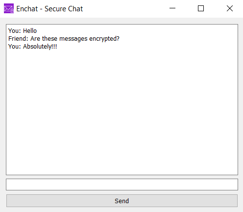

# 

EnChat is a secure chat application that enables **end-to-end encrypted communication** between two users over a local network. Built using Python, PyQt5, and hybrid AES-RSA encryption, EnChat is designed for internal use, demos, ethical hacking labs, or secure private chats.


##  Project Objective

> Develop a basic yet functional messaging application with end-to-end encryption using socket programming and a GUI.


##  Features

-  End-to-End encryption using **AES + RSA hybrid cryptography**
-  Secure message transmission via **TCP sockets**
-  Sleek **PyQt5 GUI client**
-  Console-based unified **launcher script**
-  LAN-ready, works between different machines on the same network
-  Suitable for **ethical hacking labs**, **demonstrations**, or **internal secure comms**


##  Tech Stack

| Layer     | Tool / Library         |
|-----------|------------------------|
| Language  | Python 3.x             |
| Crypto    | PyCryptodome (AES, RSA)|
| GUI       | PyQt5                  |
| Network   | Python Sockets (TCP)   |


##  Folder Structure

```
EnChat/
├── backend/
│   ├── aes_utils.py      # AES encryption logic
│   ├── rsa_utils.py      # RSA key utilities
│   ├── server.py         # Socket server
│   └── client.py         # CLI client (optional)
├── frontend/
│   └── gui.py            # PyQt5-based GUI
├── main.py               # Launcher script
```


##  Getting Started

###  Requirements

- Python 3.7+
- pip
- Linux/Kali/Windows/MacOS

###  Install Dependencies

Create a virtual environment (recommended):

```bash
python -m venv venv
source venv/bin/activate  # or .\venv\Scripts\activate on Windows
```

Install the required packages:

```bash
pip install -r requirements.txt
```


##  Usage

From the root project directory, run:

```bash
python main.py
```

You'll be prompted to start as:

```
1. Server
2. Client
```

- Select `1` to start the socket server
- Select `2` to launch the GUI client (can be run on another machine in the same network)

## Demo (Screenshtos)



##  Networking Setup (for LAN)

- Run the server on your **Windows/Linux host**
- Clients can connect from other machines (e.g., Kali VM)
- Make sure the server's IP and port (`9999`) are accessible
- Set the server IP in `gui.py` or pass it dynamically (future enhancement)


##  Example Use Case

- Open 2 terminals
- In Terminal 1 (host):
  ```bash
  python main.py  # select 1 - Server
  ```

- In Terminal 2 (client on same or VM):
  ```bash
  python main.py  # select 2 - Client
  ```

Now securely chat with encrypted messages via the GUI!


##  Future Improvements

-  Password-authenticated encryption or login
-  File sharing support (with encryption)
-  Internet connectivity via ngrok or Tailscale
-  Mobile client (via Kivy or Flutter bridge)


##  License

MIT License – Free to use, modify, and distribute with attribution.

